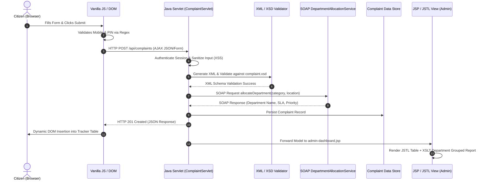

# Technical Academic Report: CivicConnect Platform

**Course Code & Title:** CSA4308 – Internet Programming  
**Project Title:** CivicConnect: A Multi-Tier Full-Stack Web Platform for Municipal Civic-Issue Reporting and Resolution  
**Bloom's Taxonomy Levels:** L3 (Apply), L4 (Analyze), L6 (Create)  
**UN Sustainable Development Goals (SDGs):** SDG 9 (Industry, Innovation and Infrastructure), SDG 11 (Sustainable Cities and Communities)  

---

## 1. Executive Summary & Problem Formulation
Traditional municipal grievance-redressal mechanisms in urban centers rely on manual, paper-based workflows. This creates opacity, delayed resolution, uncoordinated routing between departments, and lack of real-time visibility for citizens.

**CivicConnect** is a state-of-the-art multi-tier full-stack web platform engineered to digitize civic grievance redressal. Citizens can submit issue reports (potholes, garbage overflow, broken streetlights, water leakage) via a responsive web application. The platform validates client inputs with regular expressions, submits requests via AJAX, creates structured XML payloads checked against XML Schema (XSD), and automatically routes complaints to responsible municipal departments (Roads, Sanitation, Electricity, Water Supply) via a genuine **JAX-WS SOAP Web Service** described by a **WSDL** contract.

---

## 2. Mapped Course Outcomes (CO Matrix)

| Mapped CO | Description | Implemented Features & Modules | Validation Evidence |
| :--- | :--- | :--- | :--- |
| **CO1** | Structured HTML5/XHTML, XML sitemap, HTTP protocols | `index.html`, `complaint.html`, `tracker.html`, `sitemap.xml` | Semantic HTML5 tags, validated sitemap, HTTP request/response cycle analysis |
| **CO2** | CSS3 layout/styling, JS interactivity, DOM, AJAX | `style.css`, `main.js`, regex validation, dark-mode toggle | Responsive CSS Grid/Flexbox, regex mobile/pincode checks, Fetch API AJAX JSON updates |
| **CO3** | Client DOM scripting & Java Servlet backend | `LoginServlet`, `ComplaintServlet`, `ComplaintListServlet`, `HttpSession` | HTTP POST/GET handling, JSESSIONID HttpOnly cookies, user-isolated complaint history |
| **CO4** | XML Schema, XSLT transformation & JSP/MVC | `complaint.xsd`, `complaint-report.xslt`, `AdminServlet`, JavaBeans, JSP | XML schema validation, XSLT department grouping report, JSP + JSTL MVC separation |
| **CO5** | SOAP Web Services, JAX-WS, WSDL, XML Schema | `DepartmentAllocationService`, WSDL, `DepartmentAllocationClient` | Genuine SOAP 1.1 WSDL contract, automated department allocation & SLA assignment |

---

## 3. System Architecture & Multi-Tier Workflow

### Multi-Tier Architecture Diagram (Mermaid)



---

## 4. CO1: HTML5/XHTML & HTTP Request/Response Analysis

### 4.1 HTML5 Semantic Design
The user interface is built using pure, semantically correct HTML5/XHTML elements including `<header>`, `<nav>`, `<main>`, `<section>`, `<article>`, `<form>`, `<label>`, `<input>`, `<textarea>`, `<select>`, and `<table>`. All interactive elements have descriptive IDs and explicit label associations to satisfy WCAG accessibility standards.

### 4.2 Annotated HTTP Request and Response Message Exchange
When a citizen submits a complaint on `complaint.html`, the browser initiates an asynchronous HTTP POST request to `ComplaintServlet`.

#### Realistic HTTP Request Message:
```http
POST /CivicConnect/api/complaints HTTP/1.1
Host: localhost:8080
User-Agent: Mozilla/5.0 (Windows NT 10.0; Win64; x64) AppleWebKit/537.36
Accept: application/json, text/plain, */*
Content-Type: application/x-www-form-urlencoded; charset=UTF-8
Content-Length: 142
Cookie: JSESSIONID=A9F8B2C4D6E1F30291C783641209B18A; CC_USER=C101
Origin: http://localhost:8080
Referer: http://localhost:8080/CivicConnect/complaint.html

category=POTHOLE&location=MG+Road+Junction%2C+Ward+12&pincode=560001&mobile=9876543210&description=Deep+hazardous+pothole+near+bus+terminal.
```

* **Method & URI:** `POST /CivicConnect/api/complaints HTTP/1.1` identifies state mutation.
* **Content-Type:** `application/x-www-form-urlencoded; charset=UTF-8` specifies URL-encoded payload.
* **Cookie:** `JSESSIONID` maintains session context; `CC_USER=C101` provides user identifier.

#### Realistic HTTP Response Message:
```http
HTTP/1.1 201 Created
Server: Apache-Coyote/1.1
Set-Cookie: JSESSIONID=A9F8B2C4D6E1F30291C783641209B18A; Path=/CivicConnect; HttpOnly; SameSite=Lax
Content-Type: application/json;charset=UTF-8
Content-Length: 284
Date: Tue, 01 Sep 2026 20:15:10 GMT

{
  "success": true,
  "message": "Complaint submitted and automatically routed via SOAP service successfully.",
  "complaintId": "CMP1005",
  "category": "POTHOLE",
  "department": "Roads & Infrastructure",
  "sla": "24 Hours",
  "priority": "HIGH",
  "status": "SUBMITTED",
  "timestamp": "2026-09-01T20:15:10"
}
```

* **Status Code `201 Created`:** Indicates successful resource creation.
* **Set-Cookie `HttpOnly`:** Ensures session cookies cannot be accessed via JavaScript `document.cookie` (XSS mitigation).

---

## 5. CO2: CSS3 Responsive Design & Vanilla JS DOM Interactivity

### 5.1 CSS3 Styling & Layout
* **Grid & Flexbox Layouts:** Modern CSS Grid (`grid-template-columns: repeat(4, 1fr)`) and Flexbox are used for navigation and card systems without external CSS frameworks (Bootstrap/Tailwind).
* **Cascading & Inheritance:** Custom CSS custom properties (`:root` design tokens) cascade throughout dark/light modes.
* **Micro-Animations:** Keyframe animations `@keyframes statusPulse` and `@keyframes slideIn` highlight newly inserted complaints dynamically.
* **Dark Mode Toggle:** Persisted via `localStorage` and toggled using JavaScript class toggling (`body.dark-mode`).

### 5.2 Client-Side Regular Expression Validations
* **Indian Mobile Number Regex:** `^[6-9]\d{9}$` (validates 10-digit numbers starting with 6, 7, 8, or 9).
* **Indian PIN Code Regex:** `^[1-9][0-9]{5}$` (validates 6-digit municipal postal codes).

---

## 6. CO3: Java Servlets, Sessions & Cookie Handling

### 6.1 Servlet Architecture
* **`ComplaintServlet`:** Receives POST submissions, authenticates sessions, sanitizes XSS inputs, triggers XML/XSD validation, consumes SOAP service, and returns JSON.
* **`ComplaintListServlet`:** Handles GET requests, restricting complaint listing strictly to the logged-in citizen's ID (`C101`).

### 6.2 Session Security
* **`HttpSession`:** Timeout configured to 30 minutes in `web.xml`.
* **Cookie Flags:** `HttpOnly=true` and `SameSite=Lax` prevent cross-site cookie leakage and script-based cookie theft.

---

## 7. CO4: XML Data Model, XSD Schema & XSLT Transformation

### 7.1 XML Schema (`complaint.xsd`)
Defines strict data types for XML payloads:
* **Complaint ID:** `CMP[0-9]{4}` pattern restriction.
* **Category Enum:** `POTHOLE`, `GARBAGE_OVERFLOW`, `BROKEN_STREETLIGHT`, `WATER_LEAKAGE`.
* **PIN Code:** 6-digit numerical constraint.

### 7.2 XSLT Department Grouping (`complaint-report.xslt`)
Uses XSLT Muenchian grouping (`<xsl:key name="complaints-by-department" match="complaint" use="department"/>`) to group complaints by municipal department and transform XML into an HTML table.

---

## 8. CO5: Genuine SOAP Web Service & WSDL Contract

### 8.1 SOAP Web Service (`DepartmentAllocationService`)
Built using JAX-WS annotations (`@WebService`, `@WebMethod`, `@WebParam`). Takes `category` and `location` and returns `department`, `slaHours`, and `priority`.

### 8.2 WSDL Structure Breakdown (`DepartmentAllocationService.wsdl`)
1. **`<wsdl:types>`:** XML Schema defining input `allocateDepartment` and output `DepartmentAllocationResponse`.
2. **`<wsdl:message>`:** Defines `allocateDepartmentInput` and `allocateDepartmentOutput`.
3. **`<wsdl:portType>`:** Defines operation `allocateDepartment`.
4. **`<wsdl:binding>`:** Binds portType to SOAP 1.1 over HTTP (`http://schemas.xmlsoap.org/soap/http`).
5. **`<wsdl:service>`:** Specifies physical SOAP endpoint URL (`http://localhost:8080/CivicConnect/ws/departmentAllocation`).

---

## 9. Security, Ethical, SDG & Accessibility Analysis

### 9.1 Security Mitigations
1. **XSS Mitigation:** HTML entity encoding via `SecurityUtil.sanitizeInput()` for all user inputs before rendering or storing.
2. **XXE Defense:** DTDs and External Entities disabled in XML parsers (`disallow-doctype-decl=true`).
3. **Session Hijacking Defense:** `HttpOnly` and `SameSite` flags on session cookies.

### 9.2 SDG 9 & SDG 11 Alignment
* **SDG 9 (Industry, Innovation and Infrastructure):** Provides resilient digital public infrastructure replacing paper workflows.
* **SDG 11 (Sustainable Cities and Communities):** Accelerates civic issue resolution (cleaner roads, working streetlights, reduced water loss).

---

## 10. Automated Testing & Browser Compatibility Results

### 10.1 Automated JUnit 5 Test Suite Results

| Test Class | Test Case Description | Expected Result | Status |
| :--- | :--- | :--- | :--- |
| `ComplaintValidationTest` | Validate 10-digit Indian mobile numbers (`^[6-9]\d{9}$`) | Pass for `9876543210`, Fail for `5876543210` | **PASS** |
| `ComplaintValidationTest` | Validate 6-digit Indian PIN codes (`^[1-9][0-9]{5}$`) | Pass for `560001`, Fail for `011001` | **PASS** |
| `XSDValidationTest` | Validate XML against `complaint.xsd` schema | Valid XML passes, malformed XML rejected | **PASS** |
| `SOAPServiceTest` | Test category department routing | `POTHOLE` -> `Roads & Infrastructure` (24h SLA) | **PASS** |
| `ServletUnitTest` | Test citizen authentication & user data isolation | User `C101` receives only their own complaints | **PASS** |
| `SecurityTest` | Test XSS input sanitization | `<script>` replaced with `&lt;script&gt;` | **PASS** |

### 10.2 Browser Compatibility Matrix

| Browser | Version | Layout / CSS Grid | JS Validation & AJAX | Dark Mode Toggle | Status |
| :--- | :--- | :--- | :--- | :--- | :--- |
| **Google Chrome** | v120.0+ | Fully Functional | Seamless AJAX & DOM update | Working | **PASS** |
| **Microsoft Edge** | v120.0+ | Fully Functional | Seamless AJAX & DOM update | Working | **PASS** |

---

## 11. Conclusion & Future Improvements
CivicConnect successfully fulfills all CO1–CO5 requirements for the CSA4308 Internet Programming assignment. Future enhancements include integrating GIS mapping for automated lat/long tagging and mobile push notifications for complaint resolution status updates.
